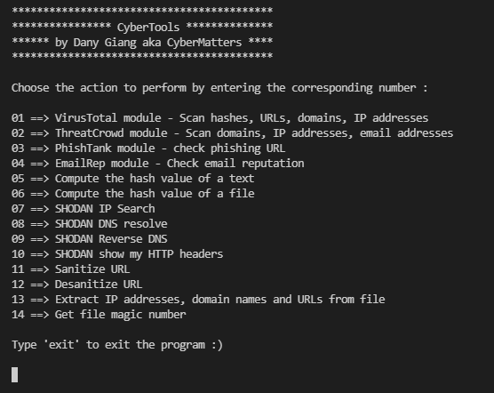

# CyberTools

Program written by Dany Giang aka CyberMatters.

## Overview

During their investigations, SOC and CERT analysts tend to use many tools to identify and analyze a threat. Switching from one to another is a loss of time. The consumption of time linked to the use of different tools available at different places might not be obvious for someone that only analyzes an indicator from time to time.

However, for SOC and CERT analysts, who perform detection and incident response, having various functionnalities in the same package can help them gain in productivity. The saved time can then be leveraged to improve detection rules, incident response processes and so on...

**CyberTools** is a program written in Python and aims to reduce the need to switch apps/programs while investigating on a potential/confirmed incident. There is no GUI as the idea is to be fast.

The included program allows the user to perform:

* VirusTotal scans for hashes / IP addresses / domain names / URLs
* ThreatCrowd scans for IP addresses / domain names / email addresses
* PhishTank scans for IP addresses
* EmailRep scans for email addresses
* Computations of MD5 / SHA1 / SHA256 hashes for a given text input
* Computations of MD5 / SHA1 / SHA256 hashes for a given file input
* Shodan IP search
* Shodan DNS resolve
* Shodan reverse DNS
* Shodan "*show my http headers*"
* Sanitization of URL
* Desanitization of URL
* Extraction of domain names, IP addresses, URLs and email addresses from a given file
* Discovery of the magic number of a file

## Requirements

### VirusTotal

If you want to use the VirusTotal functionnalities, you will need to provide a VirusTotal API key.

To provide your API key, in the `api_keys.json` file, replace `FIX-VT-KEY` with your own key.

The Public API is limited to 500 requests per day and a rate of 4 requests per minute. The Public API must not be used in commercial products or services. The Public API must not be used in business workflows that do not contribute new files. You are not allowed to register multiple accounts to overcome the aforementioned limitations.

### Shodan

If you want to use the SHODAN functionnalities, you will need to provide a SHODAN API key.

To provide your API key, in the `api_keys.json` file, replace `FIX-SHODAN-KEY` with your own key.

The API's limits depend on your subscription plan.
